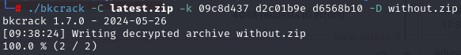

# Добро пожаловать в vulnerable standoff application

## Введение
Добро пожаловать в репозиторий проекта vuln_server! Этот проект направлен на оттачивание навыков пентестинга веб-приложений. Так же он может применяться при собеседовании на позицию junior-pentester для оценки навыков.

## Сюжет
Недавно УК City разработало приложение “Активный человек”, которое позволит властям и горожанам эффективнее контактировать друг с другом. Приложение позволяет гражданам выбирать инфраструктурные проекты для реализации в своем городе. Сегодня утром граждане увидели провокационные надписи в новом приложении, а в сети появились данные о продаже архива с данными жителей города. Глава УК City заявил прессе, что все данные были защищены с помощью шифрования, однако граждане опасаются за свою конфиденциальность. Началось расследование.

## Уязвимости
В рамках нашего проекта были исследованы следующие уязвимости:

- **A03:2021 – Injection (SQL injection)**: Это тип атаки на базы данных, при котором злоумышленник вводит вредоносный SQL-код в поля ввода, чтобы манипулировать запросами к базе данных. Это может привести к несанкционированному доступу, утечке данных, изменению или удалению информации
- **A07:2021 – Identification and Authentication Failures (IDOR)**: Уязвимость, связанная с небезопасной ссылкой на объект
- **A03:2021 – Injection (RCE via PDF creation)**: Уязвимость, связанная с небезопасной генерацией pdf-документов
- **A02:2021 – Cryptographic Failures**: Уязвимость, связанная с ненадежным шифрованием zip архива

## Технологии
В приложении использовались следующие технологии:
- **Json Web Token** для авторизации
- **SQLite** для хранения информации
- **Flask** для создания веб-приложения
- **Docker** для контейниризации приложения
- **LaTeX** для генерации документов

## Запуск
Для запуска используйте docker:
Скачайте проект, откройте терминал в корневой папке проекта и напишите команды "docker build -t <tag_name> . ", "docker run -d -p 5000:5000 -p 5022:22 --name <container_name> <tag_name>". Для взаимодействия с приложением перейдите по ссылке http://localhost:5000/

## Прохождение

  
Нажмите, чтобы открыть меню:

  - Заходим на сайт, оцениваем функциональность
  - Регистрируемся
  - Видим, что мы можем поставить лайк, а также подтвердить аккаунт. На этом этапе эксплуатируем or-based SQL-injection  и 
  - После подтверждения аккаунта нам становится доступен вход по QR. Декодируем его и видим, что для входа, используется токен и id пользователя. Меняем id на id админа
  - Оцениваем функциональность, которая доступна админу. Видим, что мы можем закрыть проект, однако, нам нехватает голосов граждан. Проведя фаззинг, видим, что данный эндпоинт также поддерживает метод POST. Далее подбираем параметр (helper), который нужно передать, чтобы обойти проверку на голоса (True)
  - Оцениваем функциональность, закрываем проект и получаем сгенерированный pdf-документ. Используя Exiftool определяем, что при генерировании использовался пакет LaTeX 
  - С помощью полезных нагрузок, приведенных в ссылке выше, проводим разведку сервера. В папке /root/.ssh находим приватный ключ id_rsa. Получаем его в pdf при помощи нагрузки 
  {\scriptsize 
\immediate\write18{cat /home/simple-user/.ssh/id_rsa | base64 > output}
\input{output}}
\end{center}
\end{document}
  - Декодируем и сохраняем в файл id_rsa (cat id_in_base64 | base64 -d > id_rsa). Видим, что это зашифрованный ключ.
  - используя ssh2john создаем hash данного ключа (ssh2john id_rsa > hash). С помощью John the Ripper подбираем пароль (john hash -wordllist=/path/to/rockyou). Получаем пароль и входим на сервер ("droopy")
  - По сюжету необходимо получить доступ к конфиденциальным данным, поэтому проводим разведку, в рабочей папке /app/instance находим archive.zip, защищенный паролем. Однако в нем используется слабое шифрование  и . Фотографию находим
  - Используя приведенные ссылки выше получаем доступ к содержимому архива: Создаем plain командой <echo -n "\x89\x50\x4e\x47\x0d\x0a\x1a\x0a\x00\x00\x00\x0d\x49\x48\x44\x52" > plain.text>
  
  
  
  - В базе данных находим конечный флаг {ThI5_IS_Your_Fl@6}

## Заключение
Спасибо за интерес к проекту! Буду рад предложениям по созданию уязвимых сервисов а также советам советам по существующих. Приятного хакинга 
